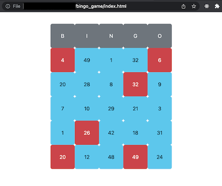

# bingo_game
Description
---
Bingo Card Game using vanilla JavaScript. 

The game resets after user has selected 5 squares in a row, column, or diagonal.

Installation
---

```
1. Clone / download repo
```

<pre>
2. Open the following file path with web browser:
 <ul><li><b><i>~/bingo_game/index.html</i></b></li></ul>
</pre>


Screenshot
---


